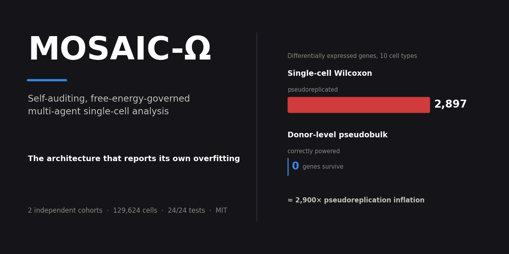

# Self-auditing agentic analysis exposes pseudoreplication in single-cell periodontitis

**MOSAIC-Ω** is a self-reconfiguring multi-agent architecture that governs a team of
analytic agents through a single convex **Free-Energy Structural Control (FESC)**
objective and carries an explicit **self-assessment layer** (adversarial
falsification, blinded adjudication, and an overconfidence detector).

This repository contains the architecture and a full application to
**single-cell periodontitis**: an analysis of two independent human gingival
cohorts that shows only a **plasma-cell compositional remodelling** replicates
across cohorts, while cell-level gene signatures are dominated by
**pseudoreplication** — a limitation the architecture flags from within the
analysis.

> **The headline is a negative result, and that is the point.** Single-cell Wilcoxon
> testing calls **2,897** differentially expressed genes; the correctly powered
> donor-level pseudobulk permutation test calls **0**. The architecture's
> overconfidence detector rises out of cohort (+0.10 → +0.34) on its own, agreeing
> with the loss of gene-level reproducibility. See
> [`docs/RESULTS_periodontitis.md`](docs/RESULTS_periodontitis.md) — read its banner first.

## Repository layout

```text
mosaic_omega/     Core architecture (pure standard library, no dependencies)
tests/            Architecture suite (24 tests) + reproducibility guards (5 tests)
analysis/         Single-cell periodontitis pipeline
figures/          Generated figures (active set + superseded_overfit/ archive)
tables/           Generated result tables (CSV)
docs/             Results write-up, figure manifest, architecture reference
data/             Large data — NOT committed; see data/README.md to download
```

## Install

```bash
git clone https://github.com/Pkr2180/mosaic-omega-periodontitis.git
cd mosaic-omega-periodontitis
python -m venv .venv && source .venv/bin/activate   # Windows: .venv\Scripts\activate
pip install -e .                 # makes `import mosaic_omega` work everywhere
pip install -r requirements.txt  # analysis dependencies (scanpy, etc.)
```

The core `mosaic_omega` package has **no third-party dependencies**; only the
single-cell analysis in `analysis/` needs the packages in `requirements.txt`.

## Reproduce

```bash
python tests/test_mosaic_omega.py      # architecture suite      -> 24/24 passed
python tests/test_reproducibility.py   # reproducibility guards  ->   5/5 passed
```

For the single-cell analysis, download the data (see [`data/README.md`](data/README.md)),
then run the `analysis/disease_*.py` and `analysis/overfitting_correction*.py` scripts
in order, followed by `analysis/disease_04_figures.py`.

The manuscript files and the manuscript-writing code are intentionally not part of
this repository.

### Reproducibility

**No file needs editing after cloning.** Every script derives its paths from the
repository root via [`analysis/_paths.py`](analysis/_paths.py):

```python
ROOT    = Path(__file__).resolve().parents[1]
DATA    = ROOT / "data"
FIGURES = ROOT / "figures"
TABLES  = ROOT / "tables"
```

so the pipeline runs identically regardless of machine, username, or operating
system. `tests/test_reproducibility.py` enforces this: it fails if any script
reintroduces a machine-specific absolute path, if the resolved paths drift from the
repository root, or if a script stops parsing.

The single-cell matrices are several GB and are not committed. To keep `data/` on
another disk, point `MOSAIC_ROOT` at a directory laid out like the repository:

```bash
export MOSAIC_ROOT=/scratch/mosaic-omega    # Windows: set MOSAIC_ROOT=D:\mosaic-omega
```

Generated `figures/` and `tables/` **are** committed, so every number and panel in
the manuscript can be inspected and re-derived without downloading the raw data or
re-running the pipeline.

## Key result

| Layer | Finding |
|---|---|
| Cell composition | Plasma cells ↑ and fibroblasts ↓ in disease — replicates in both cohorts |
| Cell-level DE | 2,897 genes by single-cell test → **0** by donor-level pseudobulk permutation (~2,900× pseudoreplication inflation) |
| Programs | 0 / 7 significant with consistent direction in both cohorts |
| Architecture | Overconfidence detector rose out of cohort (+0.10 → +0.34), agreeing with the loss of gene-level reproducibility; zero blinding leakage, zero anchoring, full branch isolation |

See `docs/RESULTS_periodontitis.md` for the full write-up and
`docs/FIGURE_MANIFEST.md` for figure provenance.

## Data

Public datasets: **GSE171213** and **GSE164241** (NCBI GEO), and the CZ CELLxGENE
Human Oral & Craniofacial Cell Atlas. Download instructions are in
`data/README.md`.

## License

MIT — see `LICENSE`.
